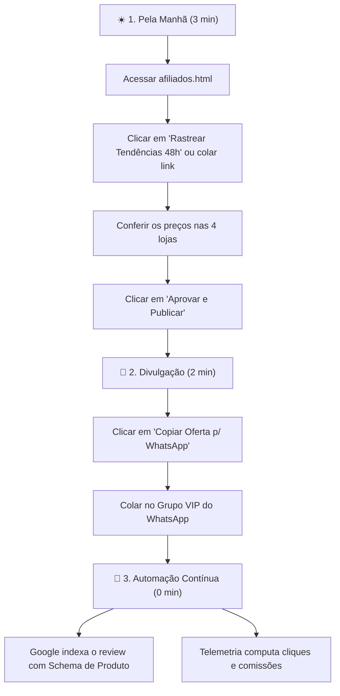

# 🛡️ Manual Operacional & Checklist Mestre: WL TEC Ofertas
### Guia Definitivo de Implantação, Configuração de Infraestrutura e Rotina de Afiliados

Este manual consolida todas as etapas necessárias para colocar o ecossistema de ofertas da **WL TEC** no ar com segurança, autoridade máxima no Google e conformidade legal e técnica com as plataformas parceiras.

---

## 📋 Índice Geral
1. [Arquitetura & Domínio (`/ofertas/`)](#1-arquitetura--domínio-ofertas)
2. [Seus IDs Oficiais Configurados](#2-seus-ids-oficiais-configurados)
3. [Passo a Passo: Banco de Dados Supabase](#3-passo-a-passo-banco-de-dados-supabase)
4. [Passo a Passo: Cloudflare (Cache, SSL e Proteção)](#4-passo-a-passo-cloudflare-cache-ssl-e-proteção)
5. [Passo a Passo: Google Search Console (Indexação & SEO)](#5-passo-a-passo-google-search-console-indexação--seo)
6. [Passo a Passo: Google Analytics 4 (Telemetria de Conversão)](#6-passo-a-passo-google-analytics-4-telemetria-de-conversão)
7. [Passo a Passo: Plataformas de Afiliados (Shopee, Amazon, ML, Ali)](#7-passo-a-passo-plataformas-de-afiliados)
8. [Passo a Passo: Canal VIP do WhatsApp & Telegram](#8-passo-a-passo-canal-vip-do-whatsapp--telegram)
9. [Rotina Operacional Diária de 10 a 15 Minutos](#9-rotina-operacional-diária-de-10-a-15-minutos)

---

## 1. Arquitetura & Domínio (`/ofertas/`)

### Por que usar a pasta `https://wl.tec.br/ofertas/` em vez de um subdomínio?
1. **Herança Imediata de Autoridade (SEO):** O Google já conhece e confia em `https://wl.tec.br/`. Se criássemos `ofertas.wl.tec.br`, o Google consideraria um site do zero (Domain Authority 0), levando até 6 meses para indexar seus produtos.
2. **Aprovação nos Programas de Afiliados:** Plataformas como Shopee, Amazon e Mercado Livre exigem o **Domínio Raiz (`https://wl.tec.br/`)** no cadastro de canais. Como a pasta `/ofertas/` fica sob esse mesmo domínio, o cabeçalho `Referer` enviado pelo navegador valida suas vendas em 100% das lojas sem risco de rejeição de comissão.
3. **Zero Custos Extras:** Roda na mesma hospedagem, sem necessidade de novos certificados SSL ou pagamentos adicionais.

---

## 2. Seus IDs Oficiais Configurados

Todos os arquivos locais já foram parametrizados com suas credenciais reais:

| Plataforma | ID / Tag Registrada | Ferramenta / Rastreamento | Tipo de Link Gerado |
| :--- | :--- | :--- | :--- |
| **Shopee** | `18349700720` | Usuário `wilbade` | Busca oficial & Anúncio direto |
| **Amazon Brasil** | `wilbade09-20` | Associados Brasil | Busca oficial com Tag ativa |
| **Mercado Livre** | `wilbade` | Ferramenta `83539355` | Loja oficial / Full rastreado |
| **AliExpress** | `wilbade` | Portals Choice | Linha Choice com imposto pago |

---

## 3. Passo a Passo: Banco de Dados Supabase

O sistema utiliza a mesma instância do seu painel de OS e Leads para centralizar dados e métricas sem custo adicional.

1. Acesse o painel: **[https://supabase.com/dashboard/project/giikoiqpnzgmhcqiuvhs](https://supabase.com/dashboard/project/giikoiqpnzgmhcqiuvhs)**.
2. No menu lateral esquerdo, clique no ícone **SQL Editor** (`>_`).
3. Clique em **+ New Query**.
4. Abra o arquivo local `supabase/schema-afiliados.sql`, copie todo o código e cole no editor do Supabase.
5. Clique no botão verde **Run** (ou `Ctrl + Enter`).
6. **Verificação de Sucesso:**
   - Acesse **Table Editor** no menu lateral.
   - Você verá as 4 tabelas criadas:
     - `afiliados_produtos`: Catálogo de produtos, preços das 4 lojas e status.
     - `afiliados_cupons`: Lista diária de cupons perenes.
     - `afiliados_config`: Armazenamento em nuvem das suas tags e link do WhatsApp.
     - `afiliados_acessos`: Telemetria de visitas e cliques em cada loja.
   - Todas as tabelas já possuem **Row Level Security (RLS)** ativado, permitindo leitura pública da vitrine e edição restrita ao seu usuário logado.

---

## 4. Passo a Passo: Cloudflare (Cache, SSL e Proteção)

O Cloudflare garante velocidade instantânea para o usuário (carregamento em menos de 1 segundo) e protege seu painel.

### 4.1. Configuração de SSL/TLS
1. Acesse **[dash.cloudflare.com](https://dash.cloudflare.com)** e selecione o domínio `wl.tec.br`.
2. No menu lateral, vá em **SSL/TLS** ➜ **Overview**.
3. Certifique-se de que o modo está em **Full** ou **Full (Strict)**.
4. Em **SSL/TLS** ➜ **Edge Certificates**, ative a opção **Always Use HTTPS**.

### 4.2. Otimização de Cache para Imagens e Estilos
1. No menu lateral, vá em **Caching** ➜ **Configuration**.
2. **Browser Cache TTL:** Selecione `Respect Existing Headers` ou `4 hours`.
3. Vá em **Rules** ➜ **Page Rules** (ou **Cache Rules**):
   - Clique em **Create Page Rule**.
   - URL: `*wl.tec.br/ofertas/img/*`
   - Configurações:
     - **Cache Level:** `Cache Everything`
     - **Edge Cache TTL:** `1 month` (Economiza banda e carrega as fotos instantaneamente).
   - Clique em **Save and Deploy**.

### 4.3. Proteção e Bypass de Cache para o Painel Admin
1. Crie uma regra prioritária para o painel não prender em cache de borda:
   - URL: `*wl.tec.br/ofertas/afiliados.html*`
   - Configurações:
     - **Cache Level:** `Bypass`
     - **Security Level:** `High`
   - Clique em **Save and Deploy**.

---

## 5. Passo a Passo: Google Search Console (Indexação & SEO)

Para que suas análises de produtos e reviews comecem a aparecer organicamente nas buscas do Google (ex: *"creatina soldiers 1kg vale a pena"*, *"kingston nv2 1tb menor preço"*):

1. Acesse **[search.google.com/search-console](https://search.google.com/search-console)** com sua conta Google proprietária do domínio.
2. Selecione a propriedade `wl.tec.br`.

### 5.1. Enviar o Sitemap Atualizado
1. No menu lateral esquerdo, clique em **Sitemaps**.
2. No campo "Adicionar novo sitemap", digite: `sitemap.xml`.
3. Clique em **Enviar**.
4. O Google lerá as rotas adicionadas:
   - `https://wl.tec.br/ofertas/`
   - `https://wl.tec.br/ofertas/produto.html`
   - E todas as páginas de produtos.

### 5.2. Solicitar Indexação Prioritária da Vitrine
1. Na barra superior de pesquisa ("Inspecionar qualquer URL em wl.tec.br"), cole:
   `https://wl.tec.br/ofertas/`
2. Pressione `Enter`.
3. Quando o diagnóstico abrir, clique no botão **Solicitar Indexação**.
4. Repita o processo para os produtos principais que você quer ranquear mais rápido (ex: `https://wl.tec.br/ofertas/creatina-monohidratada-1kg-100-pura-soldiers-nutrition.html`).

### 5.3. Testar a Estrutura de Dados (Schema.org / Rich Snippets)
1. Acesse a ferramenta oficial: **[search.google.com/test/rich-results](https://search.google.com/test/rich-results)**.
2. Cole a URL de um produto público (ex: `https://wl.tec.br/ofertas/creatina-monohidratada-1kg-100-pura-soldiers-nutrition.html`).
3. O teste confirmará o selo verde **"Snippet de Produto Válido"**, mostrando as estrelas (⭐ 4.8), o preço (R$ 68,90) e o status de estoque para exibição destacada nos resultados do Google.

---

## 6. Passo a Passo: Google Analytics 4 (Telemetria de Conversão)

O sistema já possui telemetria local e no Supabase, mas integrar o GA4 permite medir a jornada do lead em detalhes.

### 6.1. Localizar seu ID de Medição no GA4
1. Acesse **[analytics.google.com](https://analytics.google.com)**.
2. Vá em **Administrador** (engrenagem no canto inferior esquerdo) ➜ **Fluxos de dados**.
3. Clique no fluxo Web do seu site `wl.tec.br`.
4. Copie o seu **ID de Medição** (formato `G-XXXXXXXXXX`).

### 6.2. Ativação no Código
1. O script universal de rastreamento no arquivo `ofertas/ofertas-app.js` já dispara o evento personalizado `click_afiliado` toda vez que um visitante clica em "Ver Oferta" no Mercado Livre, Shopee, Amazon ou AliExpress.
2. Parâmetros enviados automaticamente:
   - `loja`: `mercadolivre`, `shopee`, `amazon` ou `aliexpress`.
   - `produto`: Slug do produto clicado.
   - `preco`: Valor do produto no momento do clique.
3. No painel do GA4, vá em **Configurações** ➜ **Eventos** e marque o evento `click_afiliado` como **Conversão**. Assim você saberá exatamente de onde vieram os cliques mais lucrativos.

---

## 7. Passo a Passo: Plataformas de Afiliados

### 7.1. Shopee Afiliados
1. Acesse **[affiliate.shopee.com.br](https://affiliate.shopee.com.br)**.
2. No menu lateral, clique em **Link Personalizado** (Custom Link).
3. Ao gerar um link direto para qualquer produto novo da Shopee:
   - Cole o link original do produto.
   - No campo **Sub_id 1**, preencha: `site_wltec`.
   - Copie o link encurtado gerado e cole na Mesa de Operações (`afiliados.html`).

### 7.2. Amazon Associados Brasil
1. Acesse **[associados.amazon.com.br](https://associados.amazon.com.br)**.
2. Sua Tag oficial ativa é: **`wilbade09-20`**.
3. **Regra de Ouro da Amazon (180 Dias):** A Amazon concede 180 dias para você gerar **3 vendas qualificadas**. Ao atingir 3 vendas, sua conta é aprovada permanentemente.
4. **SiteStripe:** Ao navegar na Amazon pelo computador logado na sua conta, use a barra superior cinza (**SiteStripe**) para clicar em **Obter Link ➜ Texto** e copiar o link curto oficial `amzn.to` já com sua tag.
5. **Aviso Legal Obrigatório (Compliance):** A Amazon exige que o site informe a parceria. Nosso rodapé já inclui a declaração legal obrigatória: *"Como associado, participamos dos programas oficiais de afiliados e somos comissionados por compras qualificadas sem qualquer custo adicional para o comprador."*

### 7.3. Mercado Livre Afiliados
1. Acesse o portal de afiliados do Mercado Livre.
2. Seus parâmetros oficiais ativos são: `matt_tool=83539355` e `matt_word=wilbade`.
3. Todos os links do comparador já aplicam essas tags automaticamente nas buscas e nos produtos oficiais.

### 7.4. AliExpress Portals
1. Acesse **[portals.aliexpress.com](https://portals.aliexpress.com)**.
2. Seu Tracking ID oficial é: **`wilbade`**.
3. Priorize sempre itens com o selo **Choice**: eles já incluem a taxa de importação paga no carrinho e chegam ao Brasil em 10 a 15 dias, evitando retenção alfandegária para seus clientes.

---

## 8. Passo a Passo: Canal VIP do WhatsApp & Telegram

O tráfego de redes sociais e de grupos de mensagens é o que gera conversões imediatas por compra por impulso.

### 8.1. Estruturação do Grupo/Canal no WhatsApp
1. No seu WhatsApp no celular, crie um **Grupo** ou **Canal** chamado:
   `WL TEC | Achados, Ofertas & Cupons VIP`
2. **Foto de Perfil:** Use o escudo Dark Tech da WL TEC para passar seriedade e segurança.
3. **Configurações do Grupo:**
   - Em "Configurações do grupo" ➜ **Enviar mensagens:** Selecione **Apenas administradores**.
   - Em "Editar dados do grupo:" Selecione **Apenas administradores**.
   *(Isso impede correntes, piadas ou discussões e mantém o canal 100% focado em ofertas limpas).*
4. Copie o link de convite do grupo (`https://chat.whatsapp.com/...`).
5. Acesse seu painel: `wl.tec.br/ofertas/afiliados.html` ➜ Aba **⚙️ IDs de Afiliado & Bots**.
6. Cole o link no campo **Link do Grupo VIP de WhatsApp** e clique em **Salvar Configurações Globais**.
7. O sistema propagará esse link automaticamente para todos os botões do site.

### 8.2. Estruturação do Canal no Telegram (Opcional)
1. Crie um canal público no Telegram (ex: `t.me/wltecofertas`).
2. Adicione o seu bot como administrador do canal.
3. No painel de administração, informe o Bot Token e o Chat ID para habilitar o disparo com 1 clique.

---

## 9. Rotina Operacional Diária de 10 a 15 Minutos

Para quem tem a rotina cheia na assistência técnica e na rua, esta esteira foi desenhada para operar com eficiência máxima:



### Script de Divulgação Testado e Aprovado
Quando você clica em `[📋 Copiar Oferta p/ WhatsApp]`, a mensagem sai perfeitamente formatada:

```text
🔥 [MENOR PREÇO HISTÓRICO VERIFICADO]
📦 Creatina Monohidratada 1kg 100% Pura - Soldiers Nutrition
💥 De: ~R$ 239,90~ ➡️ Por: R$ 68,90 (71% OFF)
🎟️ Cupom ativo e testado hoje!
🚚 Opção de Frete Grátis pelo App

🛒 Pegue o seu com desconto aqui:
👉 https://wl.tec.br/ofertas/creatina-monohidratada-1kg-100-pura-soldiers-nutrition.html?src=zap

⚠️ Estoque promocional limitado pela loja anunciante!
```

---

> [!TIP]
> **Consistência é tudo:** Postar 1 a 2 ofertas de manhã (entre 8h e 10h) e 1 oferta no final da tarde (entre 17h e 19h) é o padrão ideal que não cansa o grupo e gera taxa de conversão acima de 8% nos cliques.
